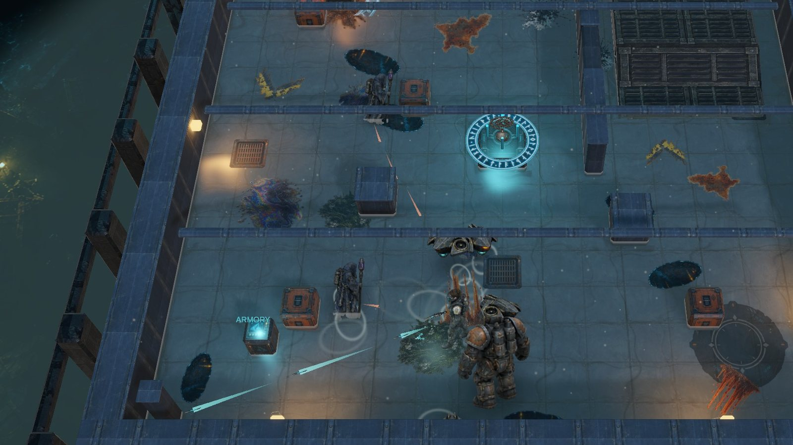
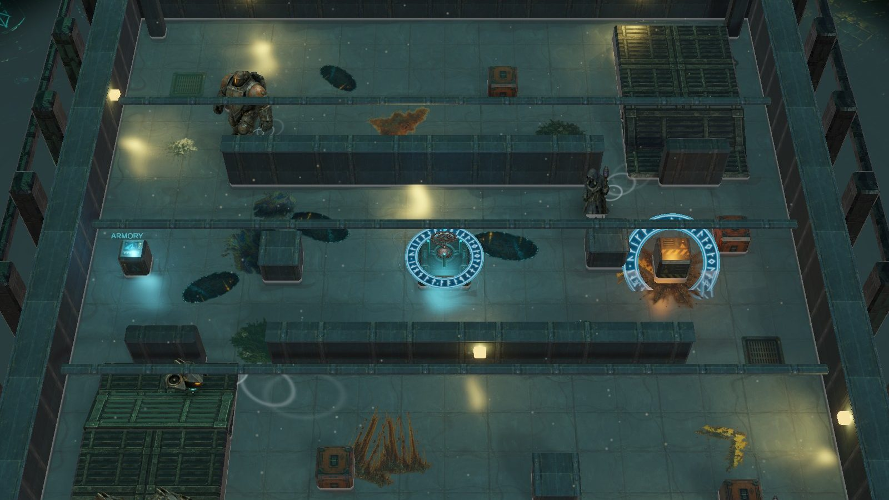
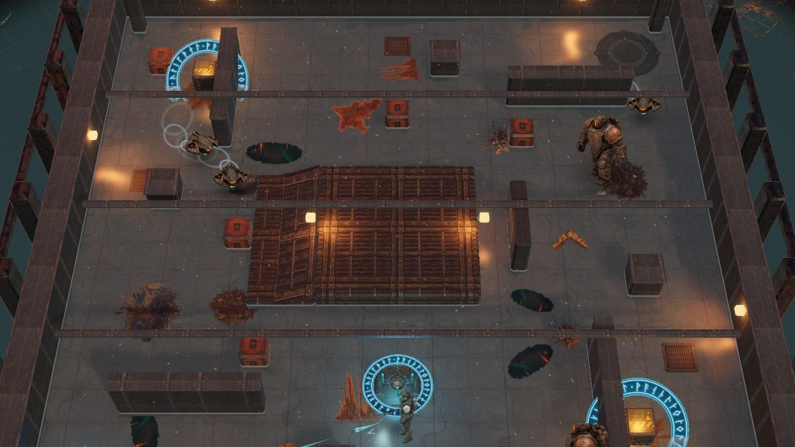
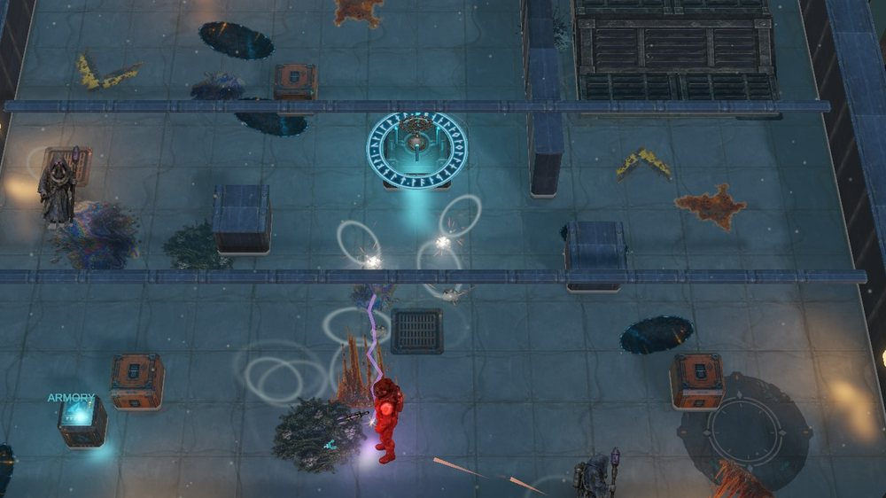
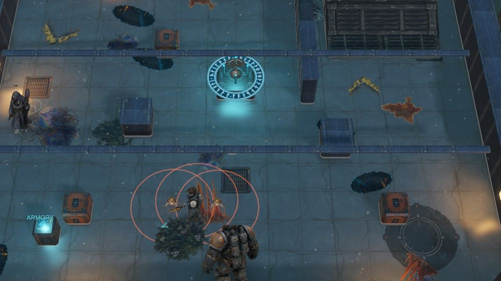

  

<h1 align="center">Rán's Wake</h1>

<b>Take the relic. Keep moving.</b> 
A top-down arcade salvage shooter inside a flooding Norse-tech shipwreck.

  <a href="https://github.com/gduplessy/RansWake-Releases/releases/latest"><b>Download the latest Windows build</b></a>
  &nbsp;·&nbsp;
  <a href="https://gduplessy.github.io/RansWake-Releases/">Game page</a>
  &nbsp;·&nbsp;
  <a href="https://github.com/gduplessy/RansWake-Releases/releases">Changelog</a>

---

Wake the Chain-Scale relic, survive the waves it calls, and reach the extraction pad before the hold goes under. The water is not scenery: it rises with every wave you clear, slows you, drags loose scrap toward the drain, and eventually drowns you. Four holds, back to back, each worse than the last.

- **Pack enemies.** Wake Drones stage and rush together, Tidecasters lead their shots and reposition, Iron Wardens charge through cover.
- **Five weapons, one armory.** Start with a Pulse Blaster for pressure and a Runic Charge whose cross-shaped blast breaks walls, crates and crowds. Spend scrap at the field terminal to unlock the **Arc Welder** (chain lightning, stronger in the flood), the **Tractor Beam** (haul scrap, drag drones, slam) and the **Mine Layer** (proximity mines), then install each weapon's module. Everything you buy carries to the next hold.
- **Terrain that matters.** Raised platforms are real high ground with shallower water. Power nodes electrify the flood around them.

| | |
|---|---|
|  |  |
| **Bilge Deck.** Bulkheads channel the water. | **Engine Gallery.** High ground, and a trap. |
|  |  |
| **Arc Welder.** Chain lightning through the pack. | **Mine Layer.** Make them walk into it. |

## Play

1. Download `RansWake-Windows-<commit>.zip` from the [latest release](https://github.com/gduplessy/RansWake-Releases/releases/latest).
2. Extract it somewhere you own, such as Documents or Desktop. Avoid Program Files: the game updates itself in place.
3. Run `RansWake/RansWake.exe`. The build is not code-signed yet, so Windows SmartScreen may say it protected your PC. Choose **More info**, then **Run anyway**.

| Control | Action |
|---|---|
| WASD | Move |
| Mouse | Aim; left button fires |
| Space | Dash |
| 1-5 / Q E | Switch weapon |
| F | Relic, terminal, extraction |
| Esc | Pause |

**System:** Windows 10 or 11 (64-bit), a DirectX 11 graphics card, about 230 MB of disk. Tested at 2560×1440, 60 fps on an RTX 3060.

## Updates

Installed builds update themselves. When a newer build is published here, the game downloads it in the background while you play, then asks: **Install and restart**, or **Later** (the pause menu keeps an **Install build N** button, and the download is reused next launch). Builds 66 to 69 predate this: open the pause menu once and choose **Update to build N**. The game downloads the zip, checks its SHA-256 against the digest GitHub publishes for the asset, confirms the build inside matches the release tag, then installs and restarts. If any file cannot be copied, the previous version is restored. The next launch tells you what happened.

Releases are tagged `b<build>-<commit>`. The game only ever moves to a higher build number.

## Status

An early build: all four holds and all five weapons are playable end to end; balance and effects are still being pushed. Found a problem? [Open an issue](https://github.com/gduplessy/RansWake-Releases/issues) with your build number (shown in the release name) and what happened.

This repository holds release builds and the [game page](https://gduplessy.github.io/RansWake-Releases/) (`docs/`) only; the Unity source is private. For milestone news, join the list at [ranswake.vercel.app](https://ranswake.vercel.app/#waitlist).

Rán's Wake is made by Georges Duplessy.
